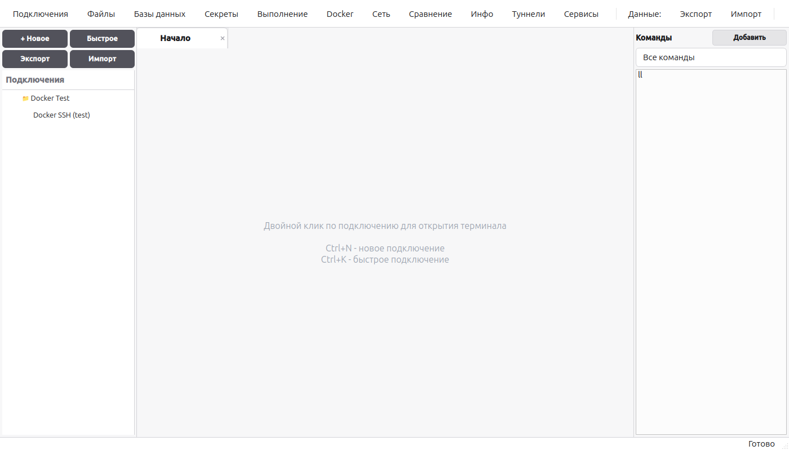
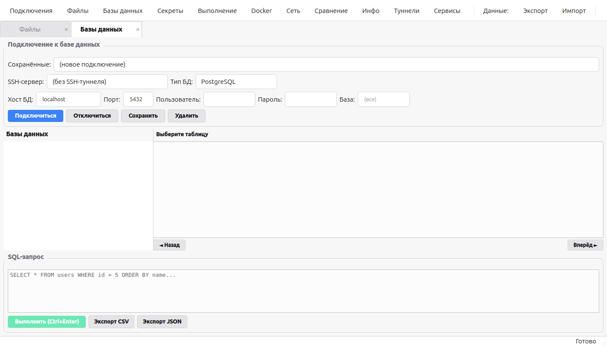
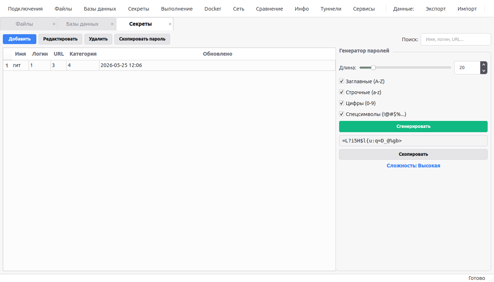
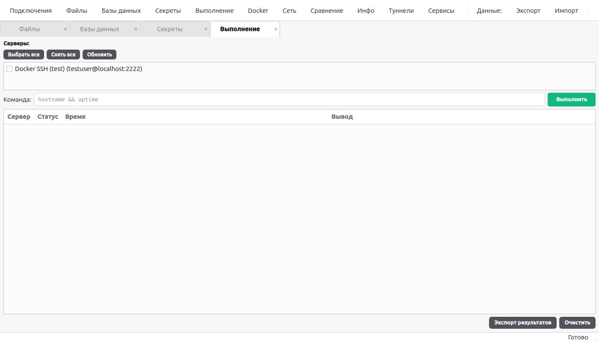
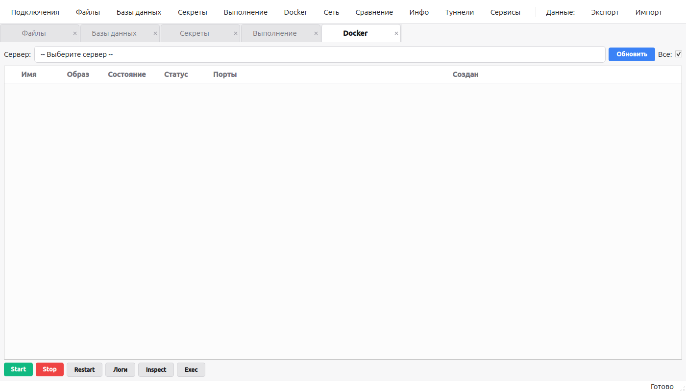
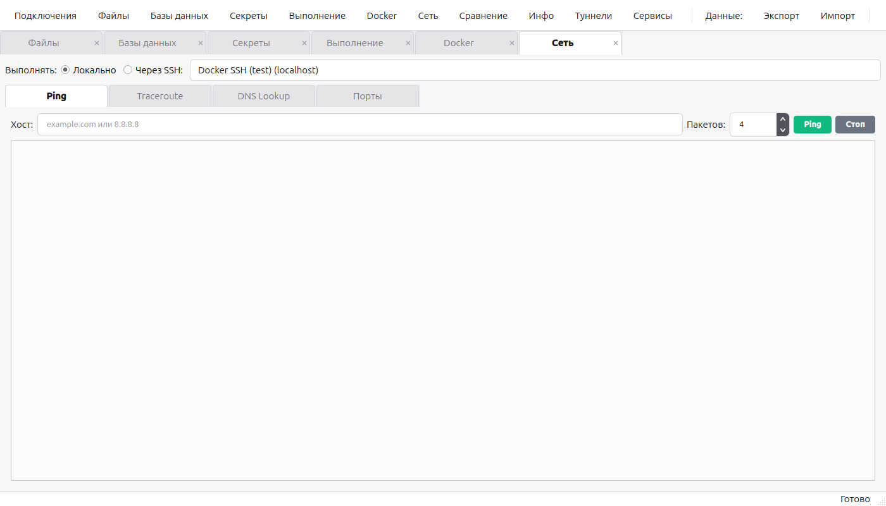
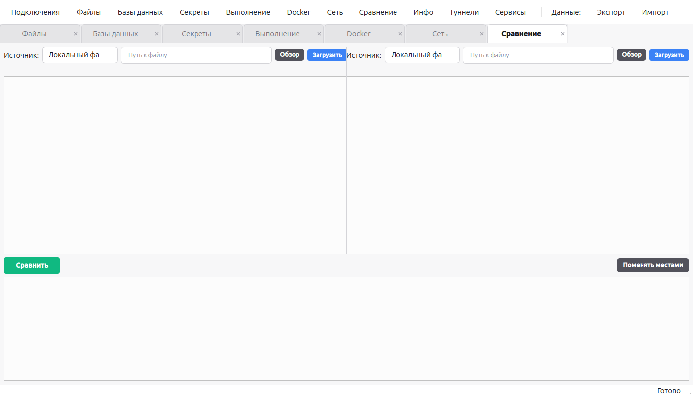
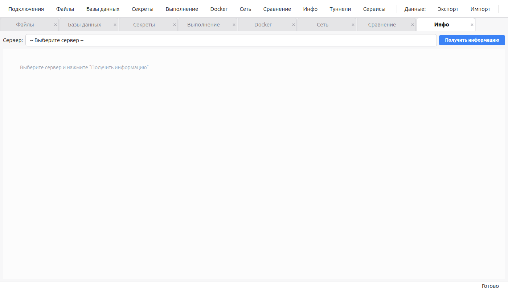
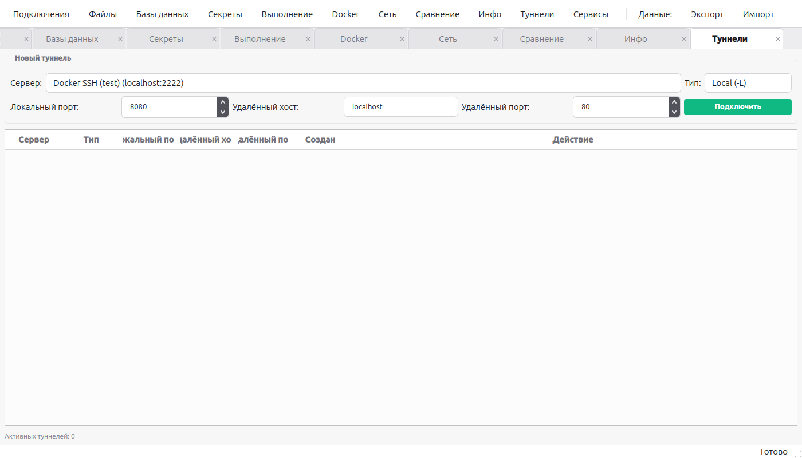
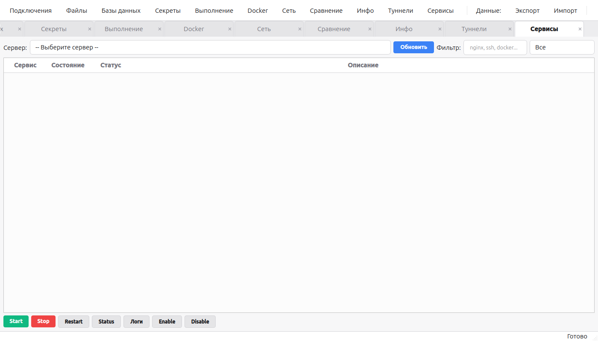

# SSH Commander

Десктопное приложение для управления SSH-подключениями, серверами и инфраструктурой.
Разработано для техподдержки и DevOps-специалистов.

**Стек**: Python 3.12, PySide6 (Qt6), Paramiko, SQLite

---

## Главное окно

Слева - дерево подключений с группировкой по категориям, справа - рабочая область с вкладками.
Быстрое подключение (`Ctrl+K`) без сохранения, полноценный PTY-терминал через pyte.



---

## Файловый менеджер

Двухпанельный Commander-стиль. Поддержка локальной ФС и SFTP.
Копирование файлов между панелями, прямой SCP сервер-сервер, рекурсивный поиск по glob-маскам.


---

## Менеджер баз данных

Подключение к PostgreSQL, MySQL, SQLite через SSH-туннель.
Обзор таблиц, inline-редактирование, SQL-редактор, экспорт в CSV/JSON.



---

## Менеджер секретов

Хранение паролей, токенов, API-ключей с категоризацией.
Шифрование мастер-ключом (Fernet/PBKDF2).



---

## Массовое выполнение команд

Выбор нескольких серверов, параллельный запуск команды.
Таблица результатов: сервер, статус, вывод, время выполнения.



---

## Docker-менеджер

Список контейнеров, start/stop/restart, логи, inspect, exec.
Фильтр: все или только запущенные.



---

## Сетевые утилиты

Ping, Traceroute, DNS Lookup, сканер портов.
Выполнение локально или на удалённом сервере. Кнопка остановки для всех утилит.



---

## Сравнение файлов

Двухпанельный diff-viewer (Unified Diff).
Источники: локальный файл или файл с SSH-сервера.



---

## Системная информация

Snapshot сервера одной кнопкой: OS, CPU, RAM, диски, IP, uptime.
Прогресс-бары с цветовой индикацией.



---

## SSH-туннели

GUI для Local (-L) и Remote (-R) port forwarding.
Несколько туннелей одновременно, кнопка отключения.



---

## Systemd-менеджер

Список сервисов с фильтрацией. Start/Stop/Restart/Enable/Disable.
Просмотр логов через journalctl с фильтром по приоритету.



---

## Безопасность

- Мастер-пароль для доступа к приложению
- Шифрование паролей (Fernet + PBKDF2, 100 000 итераций)
- Блокировка после 3 неверных попыток
- Данные хранятся локально в `~/.local/share/ssh-commander/`

## Горячие клавиши

| Клавиша | Действие |
|---------|----------|
| `Ctrl+N` | Новое подключение |
| `Ctrl+K` | Быстрое подключение |
| `Ctrl+F` | Файловый менеджер |
| `Ctrl+D` | Базы данных |
| `Ctrl+Shift+S` | Секреты |
| `Ctrl+Shift+M` | Массовое выполнение |
| `Ctrl+Shift+D` | Docker-менеджер |
| `Ctrl+Shift+N` | Сетевые утилиты |
| `Ctrl+Shift+F` | Сравнение файлов |
| `Ctrl+Shift+I` | Системная информация |
| `Ctrl+Shift+T` | SSH-туннели |
| `Ctrl+Shift+Y` | Systemd-менеджер |

## Установка

```bash
git clone <repository_url> && cd cmd
python3 -m venv .venv && source .venv/bin/activate
pip install -r requirements.txt
make run
```

Сборка бинарника (~74 MB): `make build && make install`
